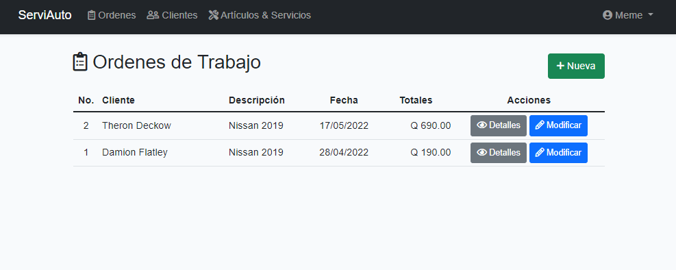
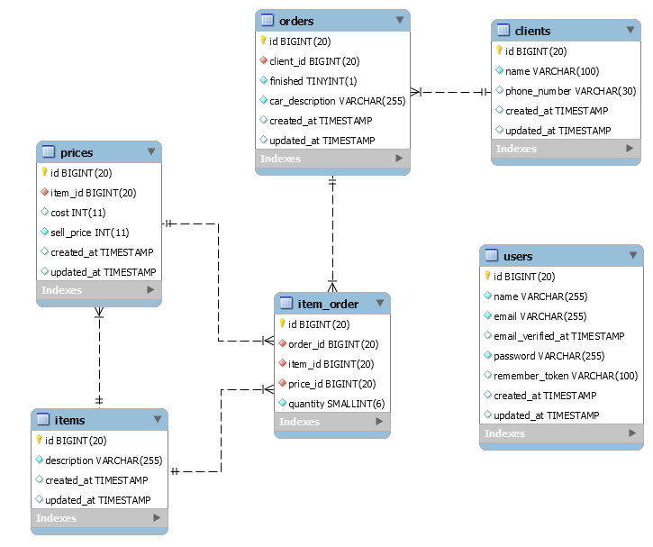
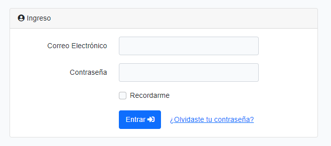
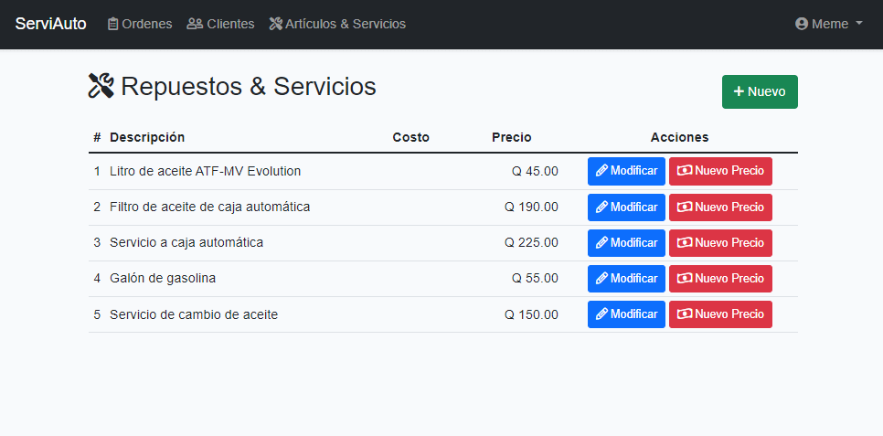
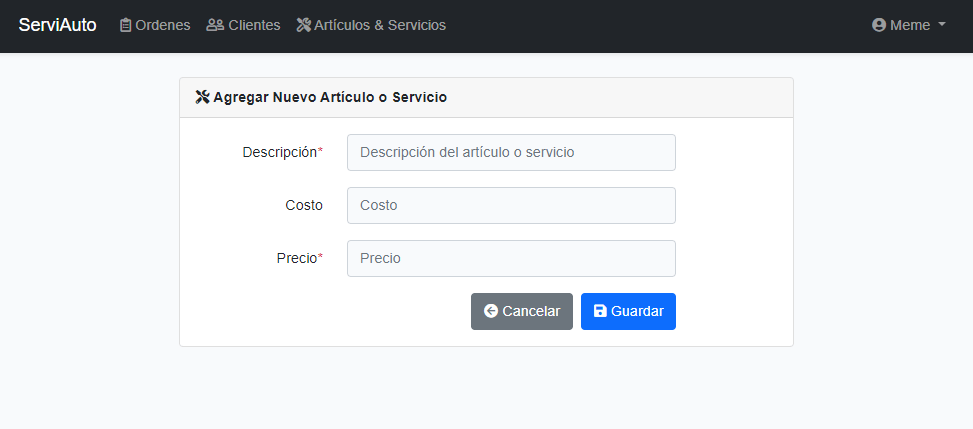
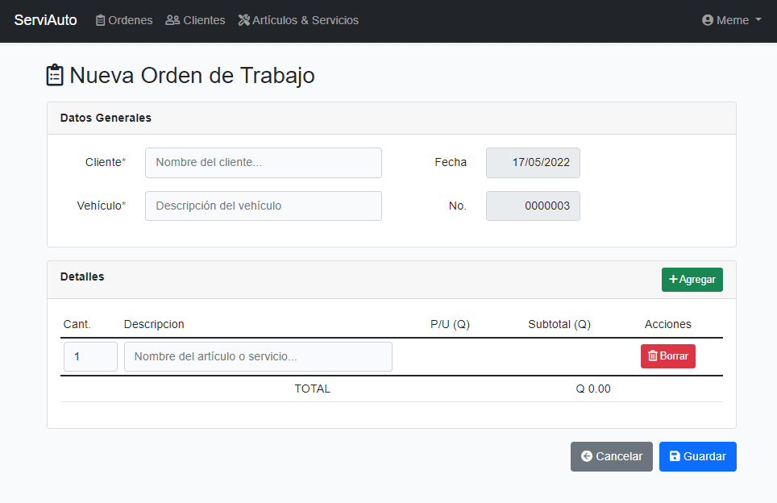
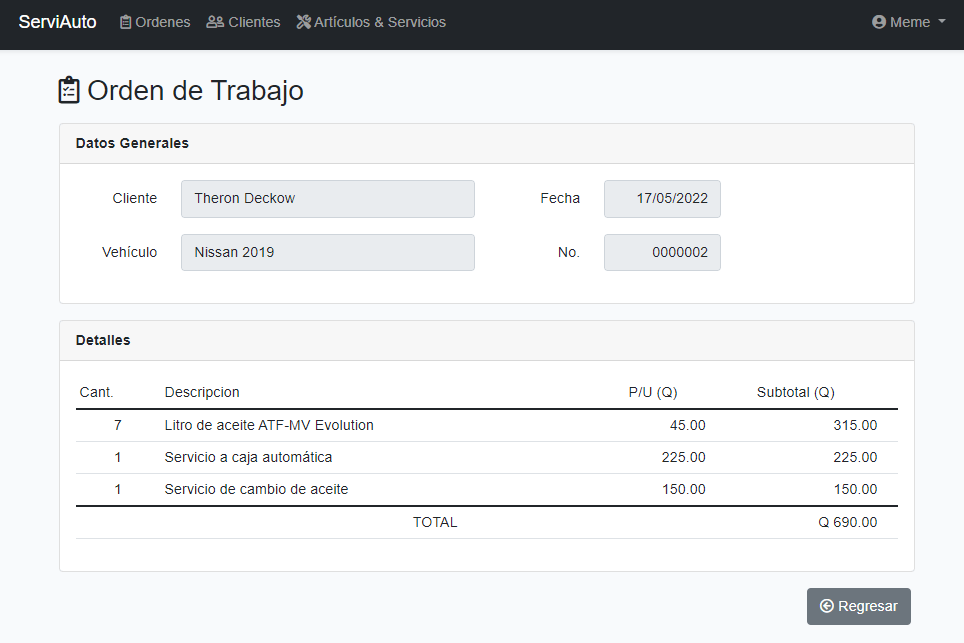
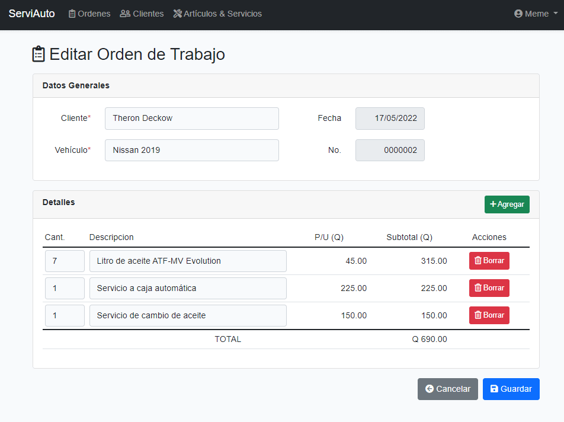

# Workshop Orders

> This is a project built with PHP with the intention of saving and keeping track of work orders.

The project is based on three main entities: items, customers, orders, and, in addition, history of the prices and users.

## Main Functions

### Login

### Items

Items list

Add item

### Orders

Order list

New order

Order details

Order edit

## Built With

- PHP 8.0.1,
- Laravel 8.83.5,
- Bootstrap 5
- Vanilla JavaScript, CSS

## Run The Project

- Get a copy of the project.
- Set-up the database for the project, in this case MySQL.
- Run the migration command `php artisan migrate` or `php artisan migrate --seed`
- Run the project with `php artisan serve` and you can find the proyect runinin on the `http://127.0.0.1:8000` url.

## Author

👤 **Meme**

- Github: [@me-skit](https://github.com/me-skit)
- Linkedin: [linkedin](https://www.linkedin.com/in/manuel-elias/)

## 🤝 Contributing

Contributions, issues and feature requests are welcome!

Feel free to check the [issues page](https://github.com/me-skit/workshop-orders/issues).

## Show your support

Give a ⭐️ if you like this project!

## 📝 License

This project isn't licensed.
